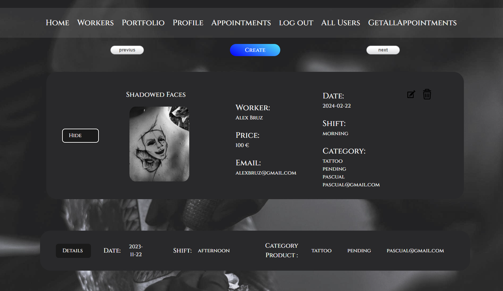

###### 

<h1 align="center"> 💥Malcriada Tatto Studio 💥</h1>
 
<div style="text-align: center;"></div>
 
<br>
<p align="center"><a href="https://github.com/vincenzo2202/Tattoo-Studio-Frontend-">https://github.com/vincenzo2202/Tattoo-Studio-Frontend-</a></p> 

# Welcome to my frontend tattoo store using react
Developed as part of the fifth project in the Full Stack Developer Bootcamp at Geekshubs Academy.

<div style="text-align: center;">
    
</div>

<br>

## Contenido

- [Introduction](#introduction)
- [Features](#features)
- [Problems and Possible Solutions](#🚧-problems-and-possible-solutions💡) 
- [Technologies Used](#technologies-used) 
- [Installation Steps](#installation-steps) 
- [Contributions](#contributions) 
- [Future Improvements](#future-improvements) 
- [License](#license)
- [Acknowledgments](#acknowledgments)
- [Author](#author) 
- [Contact](#contact) 

 <p align="center">_______________________________________________</p>

## Introduction

This project is a website for a tattoo shop, developed using React for the frontend and MySQL as the backend database. The application allows users to explore tattoo artist profiles, view their tattoo portfolios, schedule appointments, as well as update and delete appointments for efficient management.
<div style="text-align: center;"></div>

## Features

1.  <strong>Tattoo Artists' Portfolios:</strong><br>
Users can explore the profiles and portfolios of different tattoo artists. Each tattoo artist has a dedicated page showcasing a selection of their previous works.
<div style="text-align: center;"></div>

2. <strong>Appointment Management: </strong><br>
Users can schedule new appointments with their preferred tattoo artists. They also have the ability to view, update, and cancel existing appointments for better management of their schedule.

3. <strong>Super Admin View:</strong><br>
Super Admin have access to an exclusive control panel. The Super Admin view provides a comprehensive overview of the platform, allowing monitoring and management of all tattoo artist profiles, appointments, and other administrative functions.

4. <strong> Login View:</strong><br>
The login page is essential for user authentication. Here, tattoo artists and Super Admins can enter their credentials to access their respective profiles. The view includes fields for the username and password, providing a secure interface to ensure proper access to the platform's functions.

5. <strong>Profile Update View:</strong><br>
On this page, users will be able to update the information on their profiles. Fields will be provided to enter details such as name, address, and any other relevant information. Additionally, it may include options to upload a new profile picture. Upon submitting the form, the changes will be reflected in the user's profile.
<div style="text-align: center;"></div>

6. <strong>Appointment Creation View:</strong><br>
In the appointment creation view, users will be able to select an available tattoo artist, choose a date and time for the appointment, and provide additional details if necessary. There will be a form that includes fields for selecting the tattoo artist, desired date and time, as well as an area for additional comments. Upon submitting the form, the new appointment will be scheduled and reflected in the user's and the corresponding tattoo artist's calendar.
<div style="text-align: center;"></div>

7. <strong>Appointment Update View</strong><br>
The appointment update view will allow users to modify details of existing appointments. All scheduled appointments for the user will be displayed, and they can select the appointment they want to modify. There will be editable fields to adjust the date, time, and other relevant details. Additionally, they can cancel the appointment if necessary. Upon submitting the changes, the appointment will be updated in the system and reflected in the relevant calendars.

## Installation Steps:

1. Clone the Repository:
    ```
    git clone https://github.com/vincenzo2202/Tattoo-Studio-Frontend-
    cd project-5-frontend-tattoo-studio
    ```

2. Install Frontend Dependencies:
    ```
    npm install
    ```
3. Configure the Backend: 

- Create a MySQL database and configure the credentials in the project-4-backend-db-api/src/db.ts file.

- Follow the backend installation instructions:

    https://github.com/vincenzo2202/Backend_tatto-studio_API_DB.git
 
4. Install Backend Dependencies:

    ```
        npm install
    ```

5. Configure Environment Variables:

- Create a .env file in the backend directory and configure the environment variables, including the JWT secret key.

    ``` js
        // DB Credentials
        PORT =   
        DB_HOST= 
        DB_USERNAME= ""
        DB_PASSWORD= ""
        DB_NAME=""
        DB_PORT=   
        //  JWT Secret  
        JWT_SECRET= "" 
    ```  

6. Start the Application:

- In the frontend directory, run npm run dev to start the frontend
- In the backend directory, run npm run dev to start the backend server.

The application will be available at http://localhost:5173/ for the frontend and http://localhost:4000 for the backend.

Enjoy exploring the tattoo shop application!"

## Contributions
Contributions are welcome. If you have improvement suggestions or find issues, feel free to open an issue or submit a pull request.

You can contribute in two ways:

1. Open an issue.
2. Fork the repository:
    - Create a new branch
    ```
    git checkout -b feature/your-username-improvement
    ```
   - Commit your changes
    ```
    git commit -m 'feat: improve X thing'
    ```
   - Push the branch

    ```
    git push origin feature/your-username-improvement
    ```
   - Open a Pull Request

 Thank you for your support!
 
## 🚧 Problems and Possible Solutions💡
- Responsive Design Issues in Appointments and Get All Appointments Cards

    <strong>Solution:</strong> Apply React Bootstrap to make the website responsive.

- There is an issue with the pagination from the backend in the dropdowns for creating and updating appointments.

    <strong>Solution: </strong> Create a new endpoint to retrieve the complete list of workers without pagination to resolve the conflict in the dropdown.
- The header is not responsive, so it doesn't adapt to the mobile view.

## Future Improvements
- Worker view where they can manage and visualize their appointments.
- Digital payment gateway.
- Contact and reviews view.
- Footer for all views.

## Technologies Used
 
  <a target="_blank" rel="noopener noreferrer" href="https://github.com/devicons/devicon/blob/master/icons/mysql/mysql-original.svg"></a>&nbsp;
 <a target="_blank" rel="noopener noreferrer" href="https://github.com/devicons/devicon/blob/master/icons/html5/html5-original.svg"></a>&nbsp;
 <a target="_blank" rel="noopener noreferrer" href="https://github.com/devicons/devicon/blob/master/icons/css3/css3-plain-wordmark.svg"></a>&nbsp;
<a target="_blank" rel="noopener noreferrer" href="https://github.com/devicons/devicon/blob/master/icons/bootstrap/bootstrap-plain.svg"></a>&nbsp;
 <a target="_blank" rel="noopener noreferrer" href="https://github.com/devicons/devicon/blob/master/icons/javascript/javascript-original.svg"></a>&nbsp;
  <a target="_blank" rel="noopener noreferrer" href="https://github.com/devicons/devicon/blob/master/icons/react/react-original-wordmark.svg"></a>&nbsp;
<a target="_blank" rel="noopener noreferrer" href="https://github.com/devicons/devicon/blob/master/icons/git/git-original.svg"></a>&nbsp;
<a target="_blank" rel="noopener noreferrer" href="https://github.com/devicons/devicon/blob/master/icons/git/git-original.svg"></a>&nbsp;
<a target="_blank" rel="noopener noreferrer" href="https://github.com/devicons/devicon/blob/master/icons/git/git-original.svg"></a>&nbsp;
<a target="_blank" rel="noopener noreferrer" href="https://github.com/devicons/devicon/blob/master/icons/git/git-original.svg"></a>&nbsp;
<a target="_blank" rel="noopener noreferrer" href="https://github.com/devicons/devicon/blob/master/icons/git/git-original.svg"></a>&nbsp;
 
## License

This project is under the MIT License. Please refer to the LICENSE file for more information.
  
## Acknowledgments

This project has been made possible thanks to the hard work of my teachers Daniel Tarazona and David Ochando, who not only share their knowledge but also instill enthusiasm in us for what we are developing.
 
<strong>Daniel Tarazona</strong><br>
<a href="https://github.com/datata">

</a>
  
<strong>David Ochando</strong><br>
<a href="https://github.com/Dave86dev">

</a> 
  
## Author

- **Vincenzo Donnarumma Veitia**

## Contact   
<a href = "mailto:vincenzodonnarumma22@gmail.com"  target="_blank">

</a>
<a href="https://github.com/vincenzo2202"  target="_blank">
    
</a>  
<a href="https://www.linkedin.com/in/vincenzo2202/" target="_blank">

</a> 


 


 
 